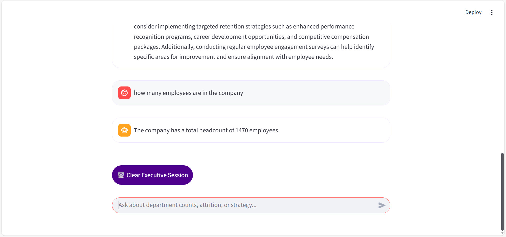

#  Strategic HR Intelligence Chatbot

**Strategic HR Intelligence** is an AI-driven executive assistant for HR leaders. It combines Qwen LLM, RAG (Retrieval-Augmented Generation), and employee data analytics to provide real-time insights, departmental attrition metrics, and strategic recommendations in plain English.

# 🔹 Features

**Natural Language Queries:** Ask questions like:  
"Which departments are at risk?" or "What is the attrition rate this quarter?"

**RAG-Powered Knowledge:** Answers are grounded in actual employee records.

**Cloud & Local Modes:**  
- **Cloud (7B API):** High-reasoning via Hugging Face.  
- **Local (1.5B):** Private processing on your machine.

**KPI Dashboard:** Real-time headcount, attrition, and risk metrics.

# 🛠️ Tech Stack

- **Python 3.10+**  
- **Streamlit:** UI Framework  
- **FAISS:** Vector Search Engine  
- **PyTorch & Transformers:** LLM Logic  
- **Pandas:** Data Processing  

# ⚡ Installation & Setup

## 1. Clone the Repository
```bash
git clone https://github.com/Latifafaisal/HR_Chatbot.git
cd HR_Chatbot
```
## 2. Create a Python Environment & Install Dependencies
```bash
python -m venv venv

# macOS/Linux
source venv/bin/activate

# Windows
venv\Scripts\activate

pip install -r requirements.txt
```
## 3. Configure Environment Variables
Create a .env file in the root folder with the following content:
```env
HF_TOKEN=your_huggingface_token_here
API_URL=https://router.huggingface.co/v1/chat/completions
CLOUD_MODEL=Qwen/Qwen2.5-7B-Instruct
LOCAL_MODEL=Qwen/Qwen2.5-1.5B-Instruct
```
## 4. Place Your HR Dataset
Ensure your HR-Employee-Attrition.csv file is in the root directory.

## 5. Run the App
```bash
streamlit run app.py
```
# 🧩 Usage
**Intelligence Engine**: Select Cloud or Local via the UI toggle.

**Querying**: Type questions like:

- "Which department has the highest attrition?"

- "How many departments are there?"

**Output**: The AI will provide a data-driven answer followed by a strategic recommendation.
**Chat Screenshot:**  


**Dashboard Screenshot:**  

# 🗂️ Project Structure
```text
HR_Chatbot/
├─ app.py                # Main Application Logic
├─ HR-Employee-Attrition.csv
├─ models/               # Local LLM Storage
├─ requirements.txt      # Dependencies
└─ .env                  # API Credentials
```
